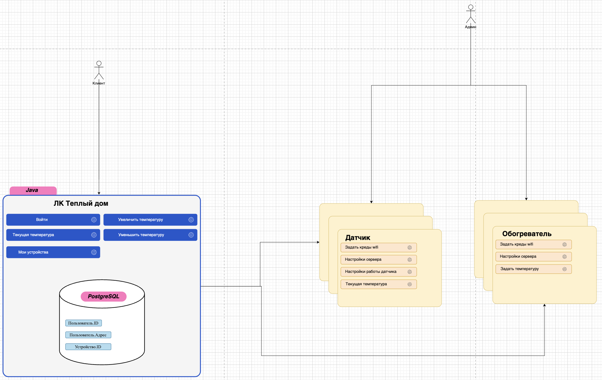
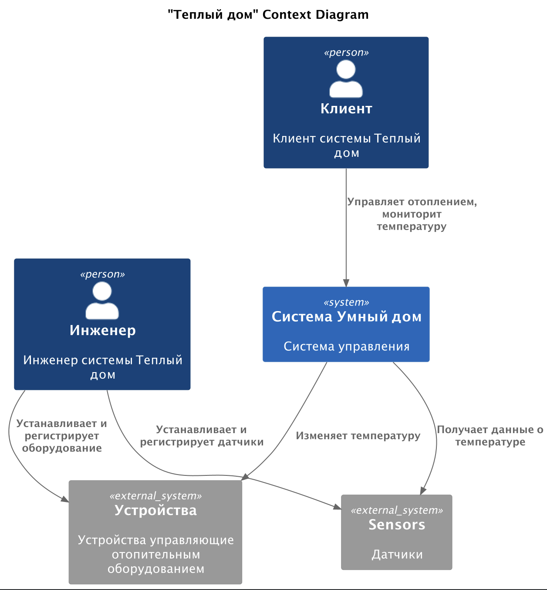
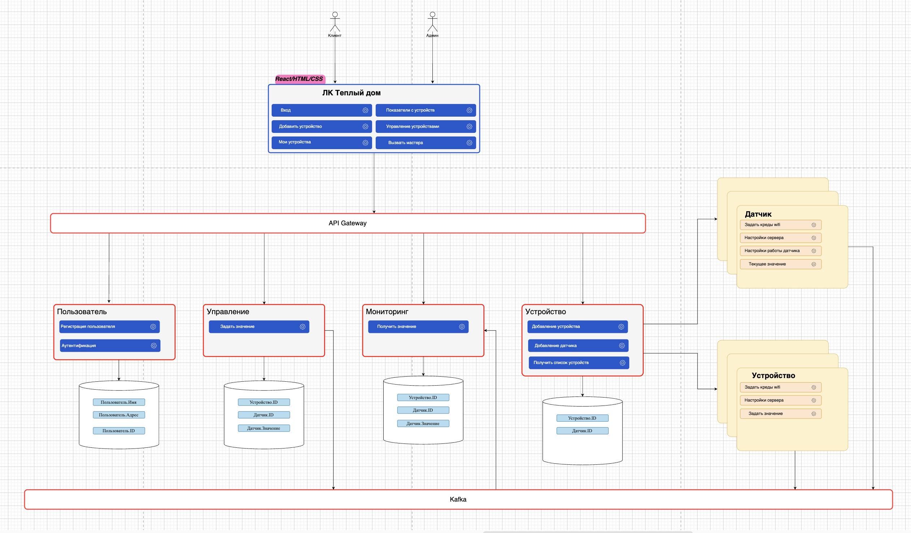
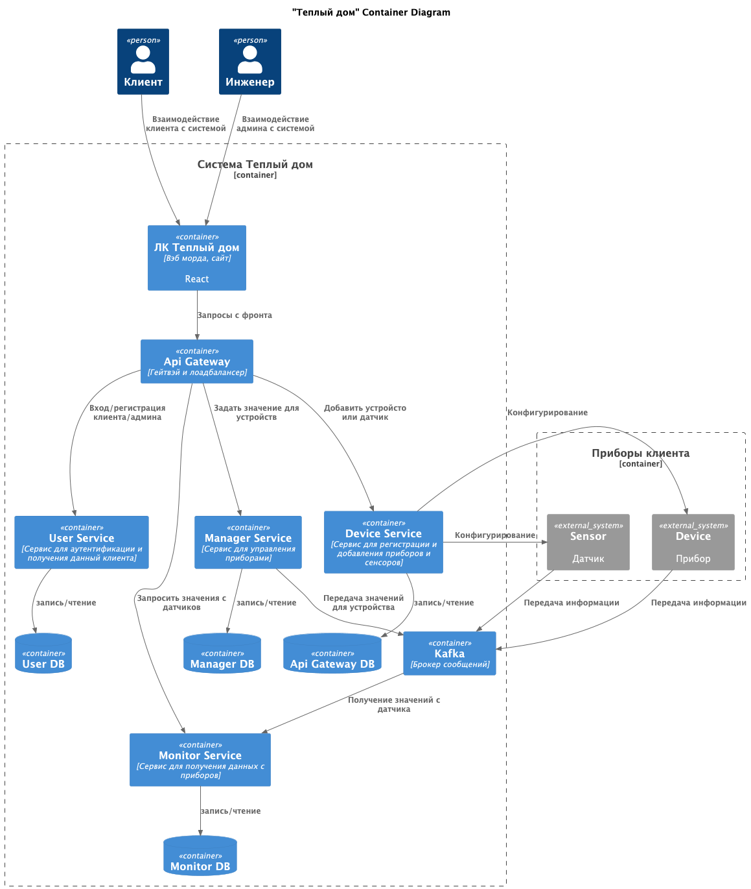
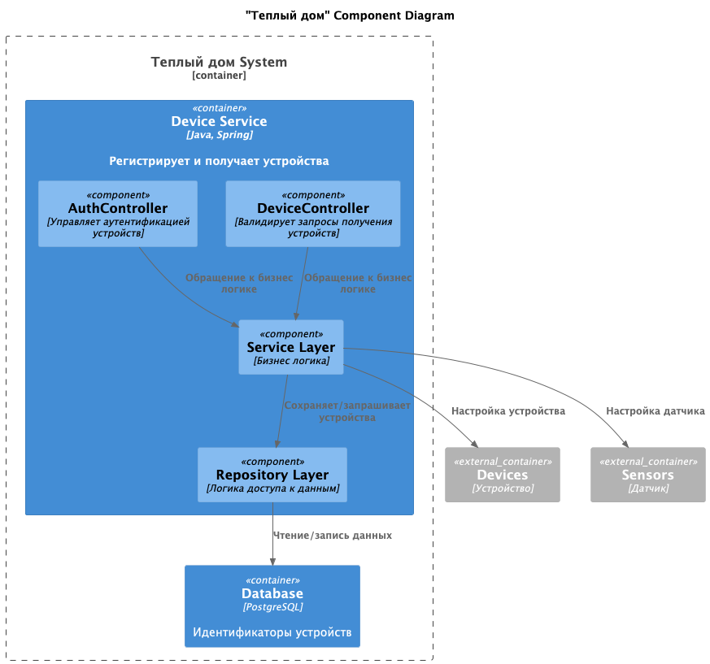
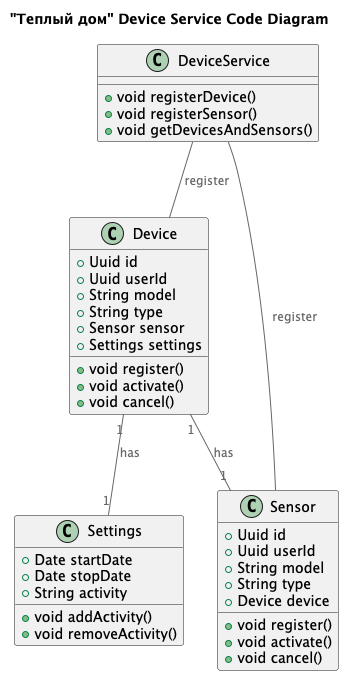
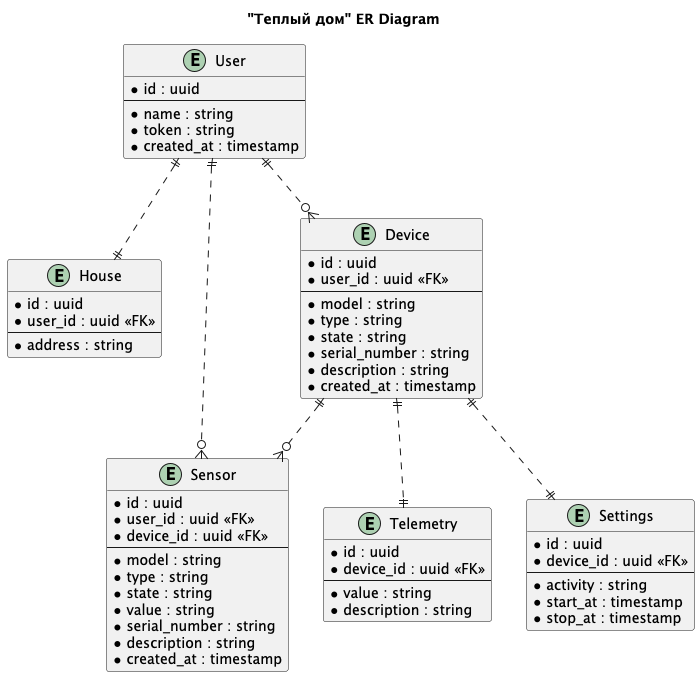

# Project_template

Тип: Материал
Родитель: Описание проекта для 11 когорты (https://www.notion.so/11-03abbbbc8bcb49ed9b85c9b6d1174056?pvs=21)

Это шаблон для решения проектной работы. Структура этого файла повторяет структуру заданий. Заполняйте его по мере работы над решением.

# Задание 1. Анализ и планирование

<aside>
💡

Чтобы составить документ с описанием текущей архитектуры приложения, можно часть информации взять из описания компани и условия задания. Это нормально.

</aside>

### 1. Описание функциональности монолитного приложения

**Управление отоплением:**

- Пользователи могут - изменять значение температуры
- Система поддерживает - управление отопительными приборами (менять температуру)

**Мониторинг температуры:**

- Пользователи могут - видеть текущую температуру
- Система поддерживает - получать данные о тукущей температуре с датчика

### 2. Анализ архитектуры монолитного приложения

Перечислите здесь основные особенности текущего приложения: какой язык программирования используется, какая база данных, как организовано взаимодействие между компонентами и так далее.
Язык - Java
БД - PostgreSQL
Архитектура - монолит, запросы обрабатываются синхронно
Масштабируемость - слабая
Деплой - через остановку приложения

### 3. Определение доменов и границы контекстов

Опишите здесь домены, которые вы выделили.
- регистрация устройств
  - регистрация датчика
  - регистрация отопительного прибора
- мониторинг температуры
  - получение текущего значения с датчика
- изменение температуры
  - увеличение температуры
  - уменьшение температуры

### **4. Проблемы монолитного решения**

- синхронная (последовательная) обработка запросов - ожидание ответов снижает производительность
- масштабируемость - только вертикальная
- развертывание - только все целиком, следовательно коллизии в работе
- разработка - все кодят один большой кусок, что приводит к конфликтам
- ручное управление - не относится к монолиту, но сильно мешавет развитию бизнеса

### 5. Визуализация контекста системы — диаграмма С4

Добавьте сюда диаграмму контекста в модели C4.

[Монолитная архитектура](c4/AsIs.png)

[Диаграмма контекста](c4/ContextAsIs.puml)

# Задание 2. Проектирование микросервисной архитектуры

В этом задании вам нужно предоставить только диаграммы в модели C4. Мы не просим вас отдельно описывать получившиеся микросервисы и то, как вы определили взаимодействия между компонентами To-Be системы. Если вы правильно подготовите диаграммы C4, они и так это покажут.

[Микросервисная архитектура](c4/ToBe.png)

[Диаграмма контейнеров](c4/ContainerToBe.puml)

[Диаграмма компонентов](c4/ComponentToBe.puml)

[Диаграмма кода](c4/CodeToBe.puml)

# Задание 3. Разработка ER-диаграммы

Добавьте сюда ER-диаграмму. Она должна отражать ключевые сущности системы, их атрибуты и тип связей между ними.

[Диаграмма ER](c4/ErToBe.puml)

Четвёртое задание — дополнительное. Его можно сделать по желанию. Чтобы ревьюер быстрее проверил ваше решение, укажите, сделали вы это задание или нет. Для этого оставьте нужный эмодзи около заголовка задания:

✅ — вы выполнили задание.

❌ — вы пропустили задание.

# ❌ Задание 4. Создание и документирование API

### 1. Тип API

Укажите, какой тип API вы будете использовать для взаимодействия микросервисов. Объясните своё решение.

### 2. Документация API

Здесь приложите ссылки на документацию API для микросервисов, которые вы спроектировали в первой части проектной работы. Для документирования используйте Swagger/OpenAPI или AsyncAPI.
